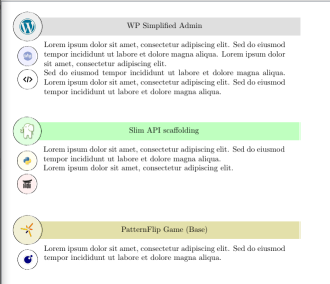

<pre>
% Personal-use package for creating boxes with an array of 
% logos aligned along the left margin.
% You are free to use this code under the terms of the 
% GNU General Public License version 3 (GPLv3).
%

% Paquete para uso personal y un requerimiento específico:
% crear cajas con múltiples logos dispuestos verticalmente
% sobre el margen izquierdo.
% Puede utilizar libremente este código bajo los términos
% de la Licencia Pública General GNU versión 3 (GPLv3).
%

 % © 2024 - Silvano Emanuel Roqués
</pre>

## Sample

